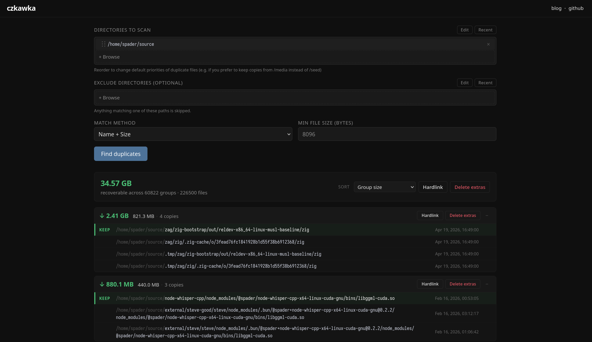

# czkawka-web


No more terrible VNC interfaces on top of good software. This is a handwritten, minimal web interface for [Czkawka](https://github.com/qarmin/czkawka), a small program which detects duplicate files.

If you, like me, end up with duplicate media files (one for the torrent client, and one in your media library) and would rather clean it up manually every once in a while rather than make four programs agree on what goes where, try this. It lets you:
- Scan directories for duplicate files (by hash, size, name, or name + size)
- Hardlink, symlink, or delete all the extra copies

That's pretty much it!

# Installation
This program is packaged as a Docker image. Mount the top level directory you want to be available to `/storage`, and map your preferred port to `3000`.
```bash
docker run --rm -it --init -p 3000:3000 -v "/path/to/root:/storage" tspader/czkawka-web
```

## Unraid

I built this for my Unraid server, so I wrote an [XML template](https://github.com/tspader/unraid/blob/main/tspader/czkawka-web.xml). Just drop that template in `/boot/config/plugins/dockerMan/templates-user`, and then in `Docker -> Add Container` on the WebUI it'll be available as a user template. 

# Development
Install and build dependencies, and then run the server locally or inside a Docker image.
```bash
bun install
bun build:czkawka
bun serve
```

To run locally inside an image you yourself built:
```bash
bun build:docker
bun serve:docker
```

## Testing
```bash
bun test
```


## unraid
I built this for Unra

Since touching your library is inherently frightening, this web UI has some affordances to stop you from nuking your machine:
- No files can be touched, ever, outside of the mount point (it won't delete your base Unraid system)
- After selecting directories to scan, only those directories can be mutated
- If files change between when you scan and when you try to delete, it'll rescan first


